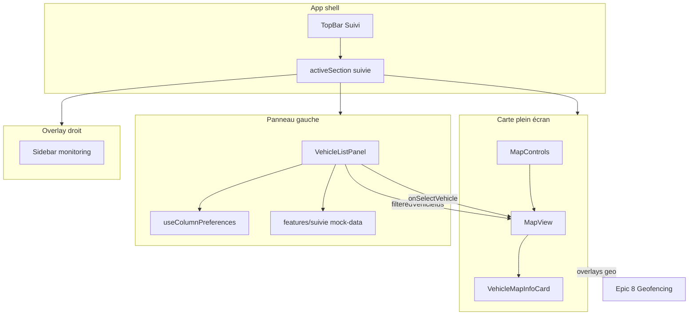
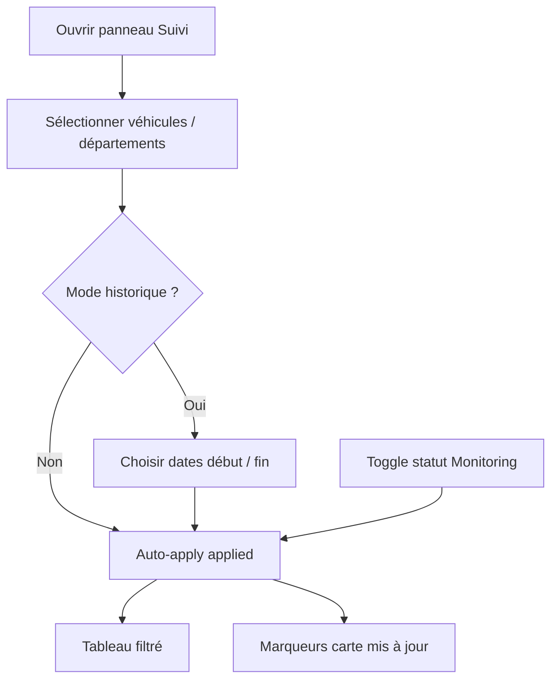
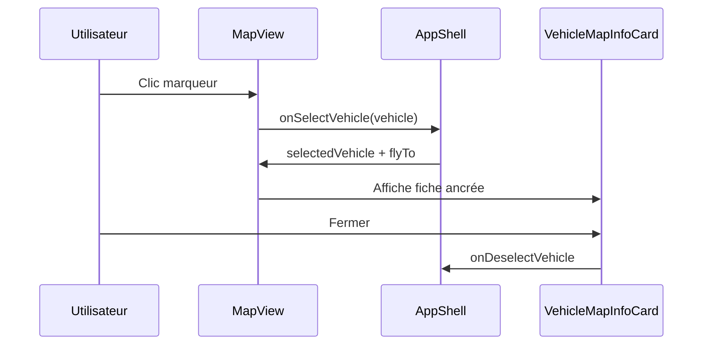

# Epic 1 – Tracking (Suivi)

**Produit** : FleetIQ  
**Version document** : 1.1  
**Date** : 10 septembre 2026  
**Objectif** : Décrire l'ensemble des fonctionnalités du module Suivi / Tracking pour permettre à l'équipe de comprendre les user stories, les critères d'acceptation et de répartir le travail en tâches.

> **Changelog 1.1** : panneau gauche (auto-apply filtres, groupement par colonne, rappels Dashboard, tri/drag headers), menu Actions branché (8 actions), monitoring filtrant par statut, marqueurs/légende colorés, focus carte + popup, trajectoire polyline mock.

---

## Table des matières

1. [Vue d'ensemble](#1-vue-densemble)
2. [Architecture et périmètre technique](#2-architecture-et-périmètre-technique)
3. [Glossaire](#3-glossaire)
4. [Features et User Stories](#4-features-et-user-stories)
   - [Feature 1 — Shell Suivi](#feature-1--shell-suivi-navigation-et-layout)
   - [Feature 2 — Filtres flotte](#feature-2--filtres-flotte)
   - [Feature 3 — Modes d'action](#feature-3--modes-daction-table)
   - [Feature 4 — Suivi général](#feature-4--suivi-général)
   - [Feature 5 — Alertes (vue Suivi)](#feature-5--alertes-vue-suivi)
   - [Feature 6 — Stop & Circulation](#feature-6--stop--circulation)
   - [Feature 7 — Trajectoire](#feature-7--trajectoire)
   - [Feature 8 — Commandes](#feature-8--commandes)
   - [Feature 9 — Personnalisation des colonnes](#feature-9--personnalisation-des-colonnes)
   - [Feature 10 — Carte live](#feature-10--carte-live)
   - [Feature 11 — Fiche véhicule carte](#feature-11--fiche-véhicule-carte)
   - [Feature 12 — Centre de monitoring](#feature-12--centre-de-monitoring)
   - [Feature 13 — Actions contextuelles véhicule](#feature-13--actions-contextuelles-véhicule)
   - [Feature 14 — Export PDF / Excel](#feature-14--export-pdf--excel)
   - [Feature 15 — Navigation cross-module](#feature-15--navigation-cross-module-vers-suivi)
   - [Feature 16 — Activation accès Suivi (compte)](#feature-16--activation-accès-suivi-compte)
5. [Matrice de dépendances](#5-matrice-de-dépendances)
6. [Dette technique et gaps identifiés](#6-dette-technique-et-gaps-identifiés)
7. [Répartition des tâches suggérée](#7-répartition-des-tâches-suggérée)

---

## 1. Vue d'ensemble

L'Epic 1 – Tracking permet aux gestionnaires et opérateurs de flotte de :

- **Surveiller la flotte en temps réel** sur une carte plein écran (positions, statut coloré, sélection véhicule, popup infos).
- **Consulter et filtrer les données télémétriques** via un panneau gauche multi-modes (Suivi général, Alertes, Stop & Circulation, Trajectoire, Commandes), avec filtres auto-appliqués.
- **Inspecter un véhicule** via une fiche ancrée sur la carte et des rappels parc (colonne Dashboard).
- **Filtrer la flotte par statut** depuis le Centre de monitoring (Circulation / Stop / Hors connexion).
- **Agir depuis le menu contextuel** (carte, trajectoire, stop/run, rapport, excès, commandes, AAD, config alertes).
- **Enchaîner depuis d'autres modules** (Dashboard, Centre d'alertes) vers le Suivi avec centrage carte.

### Principe de rédaction

Les fonctionnalités **transverses** (filtres flotte, personnalisation colonnes, sélection carte) sont décrites **une seule fois** dans leur feature dédiée. Les autres features y font référence sans les répéter.

Les **opérations géographiques** (géopérages, polygones, itinéraires, emplacements, zones Tunisie) appartiennent à l'**[Epic 8 – Geofencing](Epic-8-Geofencing.md)** et ne sont pas redécrites ici. Elles partagent la même carte Suivi.

### Synthèse des features

| # | Feature | Zone applicative |
|---|---------|------------------|
| 1 | Shell Suivi (navigation et layout) | App / TopBar |
| 2 | Filtres flotte | Panneau gauche |
| 3 | Modes d'action (table) | Panneau gauche |
| 4 | Suivi général | Panneau gauche |
| 5 | Alertes (vue Suivi) | Panneau gauche |
| 6 | Stop & Circulation | Panneau gauche |
| 7 | Trajectoire | Panneau gauche |
| 8 | Commandes | Panneau gauche |
| 9 | Personnalisation des colonnes | Panneau gauche |
| 10 | Carte live | Carte Suivi |
| 11 | Fiche véhicule carte | Carte Suivi |
| 12 | Centre de monitoring | Overlay droit |
| 13 | Actions contextuelles véhicule | Panneau gauche |
| 14 | Export PDF / Excel | Panneau gauche |
| 15 | Navigation cross-module | Dashboard / Alertes → Suivi |
| 16 | Activation accès Suivi (compte) | Administration |

---

## 2. Architecture et périmètre technique

Le module Suivi est un **workspace cartographique** piloté par l'état React `activeSection === 'suivie'` (pas de React Router). C'est la section **par défaut** au démarrage de l'application.



| Couche | Persistance | Composants clés |
|--------|-------------|-----------------|
| **Shell / navigation** | État React (`activeSection`) | `App.tsx`, `TopBar.tsx` |
| **Panneau données** | Préférences colonnes → `localStorage` (`fleetiq.suivie.columns.{action}`) ; données → mock | `VehicleListPanel.tsx`, `column-defs.ts`, `mock-data.ts`, `fleet-reminders.ts`, `vehicle-row-actions.ts`, `useColumnPreferences.ts` |
| **Carte live** | État React (sélection, centre, zoom, clusters, `trackingPath`, overlays) | `MapView.tsx`, `MapControls.tsx`, `MapLegend.tsx`, `VehicleMapInfoCard.tsx` |
| **Monitoring** | Compteurs dérivés de la flotte + `statusFilter` | `Sidebar.tsx` (`mode="monitoring"`), `App.tsx` |
| **Geofencing** | Voir Epic 8 | `MapControls`, `useMapOverlays` |

> **Important** : Les tables legacy (`SuivieFilterBar`, `SuivieGeneraleTable`, `TrajectoireTable`, `StopCirculationTable`) existent encore dans le repo mais **ne sont plus branchées**. Toute la logique filtres + tableaux est absorbée par `VehicleListPanel`.

---

## 3. Glossaire

| Terme | Définition |
|-------|------------|
| **Suivi / Tracking** | Workspace principal de surveillance live (carte + panneau données). Entrée TopBar « Suivi », `activeSection = 'suivie'`. |
| **Action (mode)** | Mode d'affichage du tableau : `suivie_generale`, `alertes`, `stop_circulation`, `trajectoire`, `commandes`. |
| **Suivi général** | Vue temps réel des véhicules (position, vitesse, chauffeur, département, télémétrie optionnelle). |
| **Horodatage** | Âge relatif de la dernière position (ex. `12 mn`, `3 h`, `2 j`). |
| **Stop / Circulation / Ralenti** | Segment d'immobilisation (`Stop`), de mouvement (`Circulation`) ou de ralenti (`Ralenti`) sur une période. |
| **Trajectoire** | Historique de segments de parcours d'un ou plusieurs véhicules sur une période ; aperçu carte via polyligne mock (`trackingPath`). |
| **Commande** | Ordre distant envoyé à un équipement (demande position, AAD, photo, etc.). |
| **Filtres appliqués** | Ensemble `AppliedSuivieFilters` synchronisé automatiquement depuis les valeurs brouillon (`draft*`) — plus de bouton « Appliquer ». |
| **Rappels parc (Dashboard)** | Colonne Suivi général à 5 icônes (entretien, documents, sinistre, paiement, contrat expiré) ; gris = inactif, coloré + dialog placeholder si actif. |
| **Clustering** | Regroupement des marqueurs carte (véhicules ou emplacements) pour alléger l'affichage. |
| **Fiche véhicule** | Popup / carte d'info ancrée sur le marqueur sélectionné (`VehicleMapInfoCard`). |
| **Centre de monitoring** | Panneau flottant droit avec compteurs de statut flotte et filtres toggle (active / idle / offline). |
| **Capacités équipement** | Flags véhicule mock : `imei`, `supportsCurrentPosition`, `supportsAad`, `supportsAadForced` — pilotent la visibilité de certaines actions menu. |

---

## 4. Features et User Stories

---

### Feature 1 — Shell Suivi (navigation et layout)

**Description** : Accès au workspace Suivi et composition de l'écran (carte plein écran, panneau gauche, monitoring droit, toolbar carte).

**Composants** : `App.tsx`, `TopBar.tsx`, `VehicleListPanel.tsx`, `MapView.tsx`, `Sidebar.tsx`

---

#### US-1.1 — Accéder au Suivi depuis la navigation

**En tant que** gestionnaire de flotte,  
**je veux** ouvrir le module Suivi depuis la barre supérieure,  
**afin de** surveiller ma flotte immédiatement.

**Critères d'acceptation :**

- [ ] L'entrée TopBar « Suivi » (`id: 'suivie'`) bascule `activeSection` vers `'suivie'`.
- [ ] Au démarrage de l'application, la section active par défaut est `'suivie'`.
- [ ] Le workspace affiche la carte en fond plein écran.

---

#### US-1.2 — Composer le layout Suivi

**En tant que** opérateur,  
**je veux** voir carte + liste + monitoring dans un même écran,  
**afin d'** avoir une vue opérationnelle complète sans changer de page.

**Critères d'acceptation :**

- [ ] Carte Leaflet (`MapView`) occupe tout le viewport sous la TopBar.
- [ ] Panneau gauche `VehicleListPanel` superposé à la carte (collapsible).
- [ ] Centre de monitoring flottant à droite (`Sidebar` `position="floating-right"`).
- [ ] Toolbar carte (`MapControls`) accessible à droite.
- [ ] Sur mobile, un fond dimmé permet de fermer le panneau gauche.

---

#### US-1.3 — Réduire / agrandir le panneau véhicules

**En tant que** opérateur,  
**je veux** replier ou redimensionner le panneau gauche,  
**afin d'** maximiser la carte quand je n'ai pas besoin du tableau.

**Critères d'acceptation :**

- [ ] Bouton chevron collapse / expand du panneau.
- [ ] Sur desktop, poignée de resize : largeur entre **600 px** et **1200 px**.
- [ ] Panneau collapsed → largeur `0`, carte visible en priorité.

---

### Feature 2 — Filtres flotte

**Description** : Filtres véhicules / départements / dates / types d'alerte auto-appliqués (draft → `applied`), plus filtre statut flotte depuis le Centre de monitoring, avec synchronisation des marqueurs carte.

**Composants** : `VehicleListPanel.tsx`, `mock-data.ts` (`applySuivieFilters`, `getFilteredVehicleIds`), `App.tsx` (`mapVehicles`, `statusFilter`)

**Référencée par** : Features 4–8, 10, 12

---

#### US-2.1 — Filtrer par véhicules et départements

**En tant que** gestionnaire de flotte,  
**je veux** sélectionner des véhicules et/ou des départements,  
**afin de** restreindre le tableau et la carte à mon périmètre.

**Critères d'acceptation :**

- [ ] Sélecteur multi avec onglets **Véhicules** / **Départements**.
- [ ] Recherche texte sur la liste des véhicules.
- [ ] Checkboxes + « Tout sélectionner » / désélection.
- [ ] Libellé bouton résumé : ex. `3 véh., 1 dép.` ou « Sélectionner véhicules ».
- [ ] Départements disponibles (mock) : `DEmo2025`, `LATRACE`, `test`, `TUNAV`.
- [ ] Logique de filtre : union (véhicule **OU** département si les deux sont renseignés).
- [ ] Toute modification met à jour `applied` automatiquement (pas de bouton Appliquer).

---

#### US-2.2 — Filtrer par plage de dates

**En tant que** gestionnaire de flotte,  
**je veux** définir une date de début et de fin,  
**afin d'** analyser l'historique sur une période.

**Critères d'acceptation :**

- [ ] Deux `DateTimePicker` (début / fin) visibles lorsque l'action ≠ `suivie_generale`.
- [ ] En mode Suivi général, la plage de dates n'est pas affichée / non appliquée.
- [ ] Le filtre date s'applique sur `filterDate` des lignes dès que les drafts changent.

---

#### US-2.3 — Auto-appliquer les filtres et synchroniser la carte

**En tant que** opérateur,  
**je veux** que mes filtres s'appliquent dès que je les change,  
**afin de** mettre à jour le tableau et la carte sans étape supplémentaire.

**Critères d'acceptation :**

- [ ] Les états draft (`draftVehicles`, `draftAction`, dates, `draftAlertTypes`) synchronisent `applied` via effet / handlers.
- [ ] Les lignes affichées passent par `applySuivieFilters`.
- [ ] Les IDs véhicules filtrés sont poussés via `onFilteredVehicleIdsChange` → `mapVehicles` dans `App.tsx`.
- [ ] Si aucun filtre véhicule/département : tous les véhicules restent sur la carte (`null`), sous réserve du `statusFilter` monitoring.
- [ ] Le filtre statut (Feature 12) restreint aussi `mapVehicles` et le tableau Suivi général.

---

#### User Flow — Filtrer la flotte



---

### Feature 3 — Modes d'action (table)

**Description** : Bascule entre les cinq modes de données du panneau Suivi.

**Composants** : `VehicleListPanel.tsx`, `column-defs.ts` (`ACTIONS`, `SuivieAction`)

---

#### US-3.1 — Changer de mode d'action

**En tant que** opérateur,  
**je veux** basculer entre Suivi général, Alertes, Stop & Circulation, Trajectoire et Commandes,  
**afin d'** adapter le tableau à ma question opérationnelle.

**Critères d'acceptation :**

- [ ] Dropdown « Action » liste les 5 modes :

| Id | Label UI |
|----|----------|
| `suivie_generale` | Suivi général |
| `alertes` | Alertes |
| `stop_circulation` | Stop & Circulation |
| `trajectoire` | Trajectoire |
| `commandes` | Commandes |

- [ ] Le changement de mode met à jour **immédiatement** `applied.action` (auto-apply).
- [ ] Les colonnes basculent selon `COLUMN_DEFS[action]`.
- [ ] Les lignes sont reconstruites via `buildRowsForAction(action, vehicles)`.
- [ ] Le mode Alertes affiche le filtre types d'alerte (Feature 5).
- [ ] Les modes historiques affichent les date pickers (Feature 2.2).

---

### Feature 4 — Suivi général

**Description** : Tableau temps réel des véhicules, avec rappels parc (Dashboard), groupement par colonne, tri/réordonnancement des headers.

**Composants** : `VehicleListPanel.tsx`, `mock-data.ts` (`buildTrackingRows`), `column-defs.ts` (`trackingColumns`), `FleetReminderCell.tsx`, `fleet-reminders.ts`

**Dépend de** : Feature 2, Feature 3, Feature 9

---

#### US-4.1 — Consulter la flotte en Suivi général

**En tant que** gestionnaire de flotte,  
**je veux** voir l'état courant de chaque véhicule,  
**afin de** savoir qui roule, où, et à quelle vitesse.

**Critères d'acceptation :**

- [ ] Colonnes visibles par défaut : Véhicule, Date / heure, Vitesse, Adresse, Chauffeur, Département, **Dashboard**.
- [ ] Colonne **Dashboard** : 5 icônes rappels parc (entretien, documents, sinistre, paiement, contrat expiré) — gris inactif ; coloré + dialog placeholder si actif (`FleetReminderCell`).
- [ ] Colonnes optionnelles disponibles (télémétrie, sondes, essieux, e-lock, etc.) via Feature 9.
- [ ] Cellules vitesse / statut / horodatage stylées (`cellClassFor`, `renderCellContent`).
- [ ] Données actuelles : mock déterministe à partir de `Vehicle` (+ `fleetReminders`).

---

#### US-4.2 — Regrouper les lignes par colonne

**En tant que** gestionnaire de flotte,  
**je veux** regrouper le tableau en glissant une colonne vers la zone « Regrouper »,  
**afin de** parcourir la flotte par dimension métier (département, chauffeur, etc.).

**Critères d'acceptation :**

- [ ] Zone drop « Regrouper » dans la toolbar (`GroupByDropZone` / `GROUP_BY_DROP_ID`).
- [ ] Drag d'un header de colonne vers la zone active le groupement (`groupByColumnId`).
- [ ] La colonne groupée est masquée du tableau ; en-têtes de groupes collapsibles.
- [ ] Tri du groupement A→Z / Z→A (`groupBySortDir`).
- [ ] Bouton clear pour retirer le regroupement.

---

#### US-4.3 — Ouvrir le menu d'actions depuis une ligne

**En tant que** opérateur,  
**je veux** ouvrir un menu contextuel sur une ligne Suivi général,  
**afin d'** accéder rapidement aux actions véhicule (Feature 13).

**Critères d'acceptation :**

- [ ] Icône kebab (`MoreVertical`) visible uniquement en mode Suivi général.
- [ ] **Seul** le clic sur ⋮ ouvre/ferme le menu (`openActionMenuAt`) — pas le clic sur la ligne.
- [ ] Clic sur la ligne sélectionne le véhicule sur la carte (`selectRowVehicle`), tous modes confondus.
- [ ] Interactions colonne Dashboard (icônes / dialog) ne déclenchent pas le menu Actions.

---

### Feature 5 — Alertes (vue Suivi)

**Description** : Historique d'alertes filtré dans le panneau Suivi (distinct du module Centre d'alertes).

**Composants** : `VehicleListPanel.tsx`, `mock-data.ts` (`buildAlertRows`, `ALERT_TYPES`)

**Dépend de** : Feature 2, Feature 3, Feature 9

> **Note** : Cette vue est un **mode tableau** du Suivi. Le Centre d'alertes (feed, configuration, inspecteur) est un module séparé (`activeSection === 'alertes'`).

---

#### US-5.1 — Consulter les alertes dans le Suivi

**En tant que** opérateur,  
**je veux** lister les alertes véhicule dans le panneau Suivi,  
**afin de** corréler alertes et positions sur la carte.

**Critères d'acceptation :**

- [ ] Colonnes par défaut : Véhicule, Date, Type d'alerte, Adresse, Vitesse, Kilométrage.
- [ ] Colonnes optionnelles : N° châssis, Action.
- [ ] Clic sur une ligne → sélection véhicule + flyTo carte.

---

#### US-5.2 — Filtrer par type d'alerte

**En tant que** opérateur,  
**je veux** restreindre la liste à certains types d'alerte,  
**afin de** me concentrer sur les événements critiques.

**Critères d'acceptation :**

- [ ] Multi-sélection des types parmi `ALERT_TYPES`, incluant notamment :
  - Dépassement de vitesse, Tous les geofences, Sortie/entrée du pays
  - Entrée/Sortie de l'itinéraire, Remorquage, Batterie débranchée
  - SOS, Température, Carburant, Conduite agressive, Stop longue durée, etc.
- [ ] Option « Toutes les alertes » ; le filtre concret ignore cette valeur sentinelle.
- [ ] Filtre appliqué automatiquement (Feature 2.3).

---

### Feature 6 — Stop & Circulation

**Description** : Segments d'arrêt, circulation et ralenti pour analyser l'activité sur une période.

**Composants** : `VehicleListPanel.tsx`, `mock-data.ts` (`buildRunStopRows`)

**Dépend de** : Feature 2, Feature 3, Feature 9

---

#### US-6.1 — Consulter Stop & Circulation

**En tant que** gestionnaire de flotte,  
**je veux** voir les périodes de stop, circulation et ralenti,  
**afin d'** évaluer l'utilisation des véhicules.

**Critères d'acceptation :**

- [ ] Colonnes par défaut : État, Matricule, Emplacement, Distance, Période, Date début.
- [ ] Colonnes optionnelles : Vitesse moy., Action.
- [ ] État affiché avec pastilles : `Stop` (rouge), `Circulation` (vert), `Ralenti` (orange).
- [ ] Footer **Total distances** (somme des km des lignes affichées).
- [ ] Action **Zoom** → focus carte véhicule (zoom ~16).
- [ ] Filtre dates disponible (Feature 2.2).
- [ ] Clic ligne → sélection véhicule sur la carte.

---

### Feature 7 — Trajectoire

**Description** : Historique de segments de parcours avec télémétrie avancée et aperçu polyligne sur la carte.

**Composants** : `VehicleListPanel.tsx`, `mock-data.ts` (`buildTrajectoryRows`), `MapView.tsx` (`trackingPath`), `vehicle-row-actions.ts` (`buildMockTrajectoryPath`)

**Dépend de** : Feature 2, Feature 3, Feature 9, Feature 10

---

#### US-7.1 — Consulter la trajectoire tabulaire

**En tant que** gestionnaire de flotte,  
**je veux** parcourir les segments de trajectoire d'un véhicule,  
**afin d'** analyser le détail d'un parcours (durée, distance, lieu, capteurs).

**Critères d'acceptation :**

- [ ] Colonnes par défaut : Stop/Circulation, Date début, Période, Vitesse, Distance, Emplacement.
- [ ] Colonnes optionnelles : alerte, carburant, batterie, contact, conso. L/100km, direction, RPM, lat/lng, sondes, essieux, etc.
- [ ] Filtre dates disponible.
- [ ] Clic ligne → sélection véhicule sur la carte.
- [ ] Après action menu « Afficher trajectoire » : polyligne mock `trackingPath` affichée sur la carte (MVP — pas d'animation / export / infos générales avancées).

---

### Feature 8 — Commandes

**Description** : Historique des commandes distantes envoyées aux équipements.

**Composants** : `VehicleListPanel.tsx`, `mock-data.ts` (`buildCommandRows`)

**Dépend de** : Feature 2, Feature 3, Feature 9

---

#### US-8.1 — Consulter l'historique des commandes

**En tant que** opérateur,  
**je veux** voir les commandes envoyées et leur état,  
**afin de** vérifier l'exécution des ordres distants.

**Critères d'acceptation :**

- [ ] Colonnes : Date d'envoi, Véhicule, Type de commande, État.
- [ ] Types de commande (mock) :
  - Demande position
  - Arrêt à distance
  - Activation contact
  - Demande photo
  - Réinitialisation GPS
- [ ] Statuts : `Exécutée`, `En attente`, `Échouée`, `Expirée`.
- [ ] Filtre dates disponible.
- [ ] Clic ligne → sélection véhicule sur la carte.

---

### Feature 9 — Personnalisation des colonnes

**Description** : Visibilité, ordre et reset des colonnes par mode d'action, persistés en localStorage.

**Composants** : `useColumnPreferences.ts`, `VehicleListPanel.tsx` (`SortableHeader`, `@dnd-kit`)

**Référencée par** : Features 4–8

---

#### US-9.1 — Afficher / masquer des colonnes

**En tant que** opérateur,  
**je veux** choisir les colonnes visibles pour le mode courant,  
**afin d'** afficher uniquement les champs utiles à ma tâche.

**Critères d'acceptation :**

- [ ] Panneau réglages colonnes listant toutes les colonnes du mode (`allColumns`).
- [ ] Toggle checkbox par colonne (`toggleVisible`).
- [ ] Impossible de masquer la **dernière** colonne visible.
- [ ] Préférences persistées sous `fleetiq.suivie.columns.{action}`.

---

#### US-9.2 — Trier et réordonner les colonnes

**En tant que** opérateur,  
**je veux** trier en cliquant un header et réordonner en le glissant,  
**afin d'** adapter la lecture du tableau sans poignée dédiée.

**Critères d'acceptation :**

- [ ] **Clic court** sur le libellé de colonne → cycle de tri asc / desc / none (`nextSortState`).
- [ ] **Maintenir + glisser** le même header → reorder (`reorder` via `@dnd-kit`) ; drop possible sur zone Regrouper (Feature 4.2).
- [ ] Pas de poignée grip séparée ; `PointerSensor` `activationConstraint.distance = 10`.
- [ ] Après un drag, le clic de tri est ignoré (`suppressSortClickRef`).
- [ ] L'ordre est persisté dans localStorage.
- [ ] Les colonnes masquées restent en fin d'ordre relatif.

---

#### US-9.3 — Réinitialiser les colonnes

**En tant que** opérateur,  
**je veux** restaurer colonnes et ordre par défaut,  
**afin de** repartir d'une configuration saine.

**Critères d'acceptation :**

- [ ] Action « reset » appelle `resetToDefault`.
- [ ] Visibilité et ordre reviennent aux `defaultVisible` / ordre de `COLUMN_DEFS`.

---

### Feature 10 — Carte live

**Description** : Affichage des positions véhicules, interactions de sélection, clustering, fonds de carte et légende. Les overlays geofencing renvoient à Epic 8.

**Composants** : `MapView.tsx`, `MapControls.tsx`, `MapLegend.tsx`, `App.tsx`

**Dépend de** : Feature 2 (filtre → marqueurs)

---

#### US-10.1 — Voir les véhicules sur la carte

**En tant que** opérateur,  
**je veux** voir les positions de ma flotte filtrée sur la carte,  
**afin d'** avoir une situation géographique immédiate.

**Critères d'acceptation :**

- [ ] Marqueurs véhicule (icônes 3D) pour chaque entrée de `mapVehicles`.
- [ ] Filtrage panneau + monitoring synchronisé (Features 2.3, 12).
- [ ] Couleurs de statut marqueur / légende :
  - **active (Circulation)** → vert `#10b981`
  - **idle (Stop)** → rouge `#f43f5e`
  - **offline (Hors connexion)** → gris `#94a3b8`
- [ ] Carte centrée sur la Tunisie (données mock flotte).

---

#### US-10.2 — Sélectionner un véhicule sur la carte

**En tant que** opérateur,  
**je veux** cliquer un marqueur pour le sélectionner,  
**afin d'** inspecter le véhicule (Feature 11).

**Critères d'acceptation :**

- [ ] Clic marqueur → `onSelectVehicle(vehicle)`.
- [ ] La carte `flyTo` vers les coordonnées (zoom ~15 en sélection simple).
- [ ] Focus depuis menu / Zoom : `mapCenter` + zoom **~16** + **popup** Leaflet (matricule/nom, lieu, vitesse, horodatage).
- [ ] La sélection est bloquée pendant un mode dessin geofencing (`drawMode` — Epic 8).
- [ ] Fermeture de la fiche → `onDeselectVehicle`.

---

#### US-10.3 — Activer / désactiver le clustering

**En tant que** opérateur,  
**je veux** regrouper les marqueurs quand la flotte est dense,  
**afin de** garder la carte lisible.

**Critères d'acceptation :**

- [ ] Menu Visibilité (`MapControls`) : toggle clustering véhicules (défaut ON).
- [ ] Toggle clustering emplacements (défaut OFF) — lié aux waypoints Epic 8.
- [ ] Clusters Leaflet MarkerCluster avec icônes dimensionnées selon le count.

---

#### US-10.4 — Changer le fond de carte

**En tant que** opérateur,  
**je veux** choisir le fond de carte,  
**afin d'** adapter la lecture (plan, satellite, etc.).

**Critères d'acceptation :**

- [ ] 4 fonds via `BASEMAP_TILES` : **Plan**, **OSM**, **Satellite**, **TUNAV**.
- [ ] Application immédiate ; fond actif identifiable dans le menu.

> Les opérations « Opération Géographique » / gestion d'overlays sont documentées dans **Epic 8**.

---

#### User Flow — Sélection véhicule carte



---

### Feature 11 — Fiche véhicule carte

**Description** : Carte d'information ancrée sur le marqueur sélectionné.

**Composants** : `VehicleMapInfoCard.tsx`, `MapView.tsx` (`SelectedVehiclePopupOverlay`)

**Dépend de** : Feature 10

---

#### US-11.1 — Consulter la fiche d'un véhicule sélectionné

**En tant que** opérateur,  
**je veux** voir les détails télémétriques du véhicule sélectionné,  
**afin de** décider sans quitter la carte.

**Critères d'acceptation :**

- [ ] Affichage cover + avatar 3D + identifiant équipement.
- [ ] Lignes d'info affichées :
  - Adresse, Date / heure, Kilométrage, Horodatage
  - Niveau du carburant, Heures moteur, Température moteur
  - Chauffeur, Vitesse, Longitude, Identifiant de carte
  - Volume, Temperature, Niveau de batterie
  - Etat de la sonde, Présence d'eau, Numéro de série, Numéro de puce
- [ ] Bandeau d'icônes statut (power / fuel / timer / flame).
- [ ] Données construites par `buildInfo(vehicle)` (seed / mock tant que l'API live n'est pas branchée).
- [ ] Bouton fermer désélectionne le véhicule.

---

### Feature 12 — Centre de monitoring

**Description** : Overlay droit de compteurs statut flotte avec filtres toggle synchronisés carte + tableau.

**Composants** : `Sidebar.tsx` (`mode="monitoring"`, `position="floating-right"`), `App.tsx` (`statusCounts`, `statusFilter`)

---

#### US-12.1 — Consulter et filtrer par statut

**En tant que** opérateur,  
**je veux** voir d'un coup d'œil le résumé statut de la flotte et filtrer dessus,  
**afin de** me concentrer sur Circulation, Stop ou Hors connexion.

**Critères d'acceptation :**

- [ ] Panneau flottant droit collapsible.
- [ ] Compteurs dérivés de `MOCK_VEHICLES` : **Total**, **Circulation** (`active`), **Stop** (`idle`), **Hors connexion** (`offline`).
- [ ] Clic sur une tuile de statut = toggle `statusFilter` → filtre `mapVehicles` et tableau Suivi général.
- [ ] Plusieurs statuts peuvent être actifs simultanément (union).

---

#### US-12.2 — Réduire le centre de monitoring

**En tant que** opérateur,  
**je veux** replier le monitoring,  
**afin de** libérer de l'espace carte.

**Critères d'acceptation :**

- [ ] Toggle collapse via `handleToggleMonitoring` / `isMonitoringCollapsed`.
- [ ] À l'entrée onboarding module, le monitoring peut être auto-collapsed.

---

### Feature 13 — Actions contextuelles véhicule

**Description** : Menu kebab du Suivi général listant les actions rapides sur un véhicule (visibilité selon admin / capacités équipement).

**Composants** : `VehicleListPanel.tsx`, `vehicle-row-actions.ts`, `RemoteStopDialog.tsx`, `GeneralReportDetailsPage.tsx`, `AlertConfigurationPage.tsx`, `App.tsx`

**Dépend de** : Feature 4, Feature 10

---

#### US-13.1 — Afficher un véhicule sur la carte depuis le menu

**En tant que** opérateur,  
**je veux** localiser un véhicule depuis le tableau,  
**afin de** le retrouver rapidement sur la carte.

**Critères d'acceptation :**

- [ ] Action « Afficher sur la carte » → `onFocusVehicleOnMap` (sélection + `mapCenter` zoom ~16 + popup).
- [ ] Si aucun `imei` (équipement non assigné) → dialog d'avertissement, pas de centrage.
- [ ] Reste sur l'onglet État général.

---

#### US-13.2 — Enchaîner les actions métier depuis le menu

**En tant que** opérateur,  
**je veux** lancer trajectoire, stop/run, rapport, excès, commandes, AAD ou paramétrage alertes depuis le menu,  
**afin d'** agir sans quitter le parcours Suivi.

**Critères d'acceptation :**

- [ ] Entrées typées (`VehicleRowActionId`) filtrées par visibilité :
  - Afficher trajectoire → mode `trajectoire` + véhicule + polyligne mock
  - Afficher Stop/Circulation → mode `stop_circulation` + véhicule
  - Afficher le rapport détaillé → section `rapport_detail` (`GeneralReportDetailsPage`, export Excel/PDF stub)
  - Afficher les excès de vitesse → mode `alertes` + type « Dépassement de vitesse » + période jour
  - Demande position actuelle → visible si `supportsCurrentPosition` ; bascule `commandes` + dialog confirmation
  - Arrêt à distance (AAD) → visible si admin + `supportsAad` ; `RemoteStopDialog` (désactiver / activer / forcé si supporté) puis `commandes`
  - Paramétrage des alertes → visible si admin ; `alert_configuration` avec `initialVehicleId`
- [ ] Helper `focusSuivieAction` : pré-sélection véhicule + dates / alertTypes + fermeture menu.
- [ ] Hors scope MVP restant : animation trajet, export réel, multi-véhicules AAD, sync boîtier.

---

### Feature 14 — Export PDF / Excel

**Description** : Export du tableau Suivi filtré.

**Composants** : `VehicleListPanel.tsx` (boutons UI)

---

#### US-14.1 — Exporter le tableau courant

**En tant que** gestionnaire de flotte,  
**je veux** exporter les données affichées en PDF ou Excel,  
**afin de** les partager ou archiver.

**Critères d'acceptation :**

- [ ] Boutons **PDF** et **Excel** visibles dans la barre d'actions du panneau.
- [ ] **État actuel (stub)** : aucun handler branché.
- [ ] **Cible future** :
  - [ ] Export du jeu de lignes **filtré** et des colonnes **visibles**.
  - [ ] Nom de fichier contextualisé (mode + date).
  - [ ] Respect des droits d'accès compte (Feature 16).

---

### Feature 15 — Navigation cross-module vers Suivi

**Description** : Entrée dans le Suivi depuis Dashboard ou Centre d'alertes avec sélection et centrage d'un véhicule.

**Composants** : `App.tsx` (`handleNavigateToVehicle`), Dashboard, Alert Center

---

#### US-15.1 — Ouvrir un véhicule depuis le Dashboard ou les Alertes

**En tant que** opérateur,  
**je veux** cliquer un véhicule ailleurs dans l'app et arriver sur le Suivi centré dessus,  
**afin de** passer de l'alerte / KPI à la carte sans recherche manuelle.

**Critères d'acceptation :**

- [ ] `handleNavigateToVehicle(vehicleId, coordinates)` :
  - set `activeSection` / `activeTab` → `'suivie'`
  - set `selectedVehicleId`
  - set `mapCenter` aux coordonnées
- [ ] La carte centre / flyTo sur le véhicule.
- [ ] La fiche véhicule s'affiche (Feature 11).

---

### Feature 16 — Activation accès Suivi (compte)

**Description** : Droit d'accès page Suivi au niveau compte.

**Composants** : `features/admin` — `AccountFormStepper` / `ACCESS_PAGES` (`id: 'suivi'`). Voir **[Epic — Administration](Epic-Administration.md)** (Feature 1).

---

#### US-16.1 — Activer l'accès Suivi pour un compte

**En tant que** super-administrateur,
**je veux** activer ou désactiver l'accès à la page Suivi pour un compte,
**afin de** contrôler qui peut surveiller la flotte.

**Critères d'acceptation :**

- [ ] Dans le formulaire compte (stepper étape 4), une page d'accès « Suivi » (`id: 'suivi'`) est disponible.
- [ ] L'état est persisté avec le compte (mock admin / modèle admin).
- [ ] *(À brancher côté UI)* : si désactivé, l'entrée TopBar Suivi / workspace n'est pas accessible pour ce compte.

---

## 5. Matrice de dépendances

| Feature | Dépend de |
|---------|-----------|
| Feature 1 | — (autonome) |
| Feature 2 | Feature 1 |
| Feature 3 | Feature 1, Feature 2 |
| Feature 4 | Feature 2, Feature 3, Feature 9 |
| Feature 5 | Feature 2, Feature 3, Feature 9 |
| Feature 6 | Feature 2, Feature 3, Feature 9 |
| Feature 7 | Feature 2, Feature 3, Feature 9 |
| Feature 8 | Feature 2, Feature 3, Feature 9 |
| Feature 9 | Feature 3 |
| Feature 10 | Feature 1, Feature 2 |
| Feature 11 | Feature 10 |
| Feature 12 | Feature 1, Feature 2 (filtre statut) |
| Feature 13 | Feature 4 (menu), Feature 3 (modes), Feature 10 (carte), Feature 8 (commandes) |
| Feature 14 | Feature 2, Feature 3, Feature 9 |
| Feature 15 | Feature 1, Feature 10, Feature 11 |
| Feature 16 | — (autonome, admin) |

### Composants partagés

| Composant | Utilisé par |
|-----------|-------------|
| `VehicleListPanel` | Features 2–9, 13, 14 |
| `useColumnPreferences` | Feature 9 (consommée par 4–8) |
| `fleet-reminders` / `FleetReminderCell` | Feature 4 |
| `vehicle-row-actions` | Feature 13 |
| `MapView` | Features 10, 11, 13, 15 ; Epic 8 |
| `MapControls` | Feature 10 ; Epic 8 |
| `applySuivieFilters` | Features 2, 4–8 |

### Lien avec Epic 8

| Sujet | Document |
|-------|----------|
| Géopérages, polygones, routes, emplacements, zones TN | Epic 8 |
| Affectation zones / alertes geofence | Epic 8 |
| Toolbar « Opération Géographique » | Epic 8 (Feature 1) |
| Carte live, basemap, clustering véhicules | **Cet epic** (Feature 10) |

---

## 6. Dette technique et gaps identifiés

| # | Gap | Impact | Priorité suggérée |
|---|-----|--------|-------------------|
| G1 | **Pas de flux GPS live** — positions mock / seed | Suivi non temps réel en prod | Haute |
| G2 | **Export PDF/Excel stub** | Pas de reporting opérationnel depuis le panneau | Haute |
| G3 | **Menu contextuel UX branché (mocks)** — API commandes / AAD multi non réels | Parcours métier incomplets en prod | Moyenne |
| G4 | **KPIs monitoring dérivés des mocks** — pas encore d'API flotte live | Indicateurs non temps réel | Moyenne |
| G5 | **Trajectoire : polyligne mock MVP** — pas d'animation / export / infos générales | Analyse parcours limitée | Moyenne |
| G6 | **Tables legacy orphelines** (`SuivieFilterBar`, `*Table`) | Dette / confusion maintenance | Basse |
| G7 | **Feature flag compte Suivi** non branché sur l'accès UI | Droit d'accès inopérant | Moyenne |
| G8 | **Mode Alertes Suivi vs Centre d'alertes** non unifiés | Double source de vérité alertes | Moyenne |
| G9 | **Légende / couleurs statut alignées** — compteurs légende encore partiellement décoratifs | Incohérence visuelle résiduelle | Basse |
| G10 | **Onboarding module `tracking`** marqué `available: false` | Activation produit incomplète | Basse |
| G11 | **Rappels parc Dashboard** : dialogs placeholder, pas de branchement Parc | Actions entretien/docs/sinistre non persistées | Moyenne |

---

## 7. Répartition des tâches suggérée

### Équipe Frontend

| Tâche | Features | Détail |
|-------|----------|--------|
| Stabiliser UX panneau | 1–3, 9 | Collapse, resize, auto-apply filtres, a11y |
| Brancher API derrière menu Actions | 13, 8 | Remplacer mocks commandes / AAD / rapport par API |
| Brancher rappels Parc | 4 | Dialogs Dashboard → modules entretien / docs / sinistres / location |
| Export PDF/Excel | 14 | Colonnes visibles + lignes filtrées |
| Trajectoire carte avancée | 7, 10 | Polyligne historique réelle + animation / métriques / export |
| KPIs live | 12 | Brancher compteurs / filtres sur agrégats flotte API |
| Feature flag Suivi | 16 | Masquer TopBar / workspace si accès off |
| Nettoyage legacy | — | Supprimer ou archiver `SuivieFilterBar` / tables orphelines |
| Tests | 2, 9, 13 | `applySuivieFilters`, `useColumnPreferences`, `vehicle-row-actions` |

### Équipe Backend

| Tâche | Features | Détail |
|-------|----------|--------|
| API positions live | 4, 10, 11 | Stream / poll positions, statut, vitesse |
| API historique | 5–7 | Alertes, stop/run, trajectoire par véhicule + période |
| API commandes | 8, 13 | Envoi + statut Demande position / AAD / photo / reset GPS |
| API export | 14 | Génération PDF/Excel côté serveur si volumes élevés |
| Droits page Suivi | 16 | Enforcement accès `suivi` |

### Équipe Intégration / DevOps

| Tâche | Détail |
|-------|--------|
| Remplacer mocks `features/suivie` | Brancher MSW → API réelle |
| Unifier alertes Suivi ↔ Centre d'alertes | Même taxonomie / mêmes IDs événements |
| WebSocket / SSE positions | Latence tracking temps réel |

---

## Annexe — Types de données clés

### Vehicle (carte / sélection)

```
id, name, status: active|idle|offline, speed, location, coordinates [lat,lng],
lastUpdate, driver, batteryLevel, departmentId?, groupIds?, matricule?,
imei?, supportsCurrentPosition?, supportsAad?, supportsAadForced?,
iconType?, heading?
```

### AppliedSuivieFilters

```
action: SuivieAction,
vehicleIds: Set<string>,
departments: Set<string>,
startDate: string,
endDate: string,
alertTypes: Set<string>
```

### Modes et colonnes par défaut

| Mode | Colonnes visibles par défaut |
|------|------------------------------|
| Suivi général | Véhicule, Date / heure, Vitesse, Adresse, Chauffeur, Département, Dashboard |
| Alertes | Véhicule, Date, Type d'alerte, Adresse, Vitesse, Kilométrage |
| Stop & Circulation | État, Matricule, Emplacement, Distance, Période, Date début |
| Trajectoire | Stop/Circulation, Date début, Période, Vitesse, Distance, Emplacement |
| Commandes | Date d'envoi, Véhicule, Type de commande, État |

### Préférences colonnes (localStorage)

```
key: fleetiq.suivie.columns.{action}
value: { order: string[], visible: Record<string, boolean> }
```

---

*Document mis à jour (v1.1) à partir de l'analyse du code frontend FleetIQ — Epic 1 Tracking (module Suivi).*
