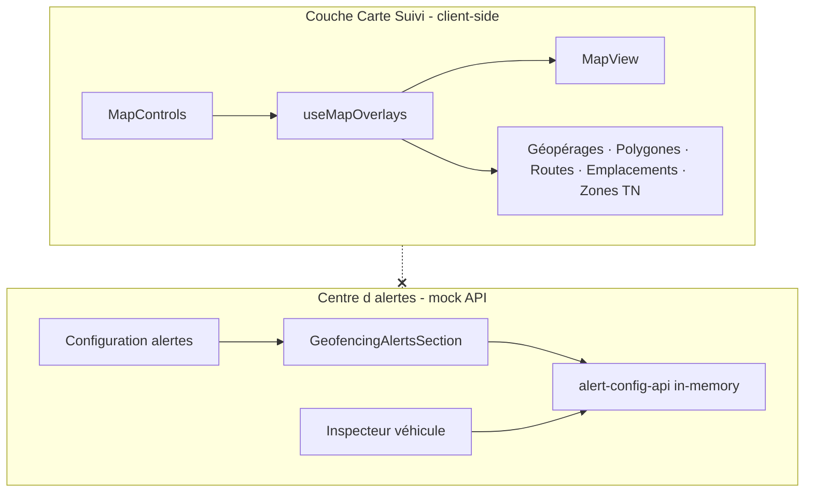
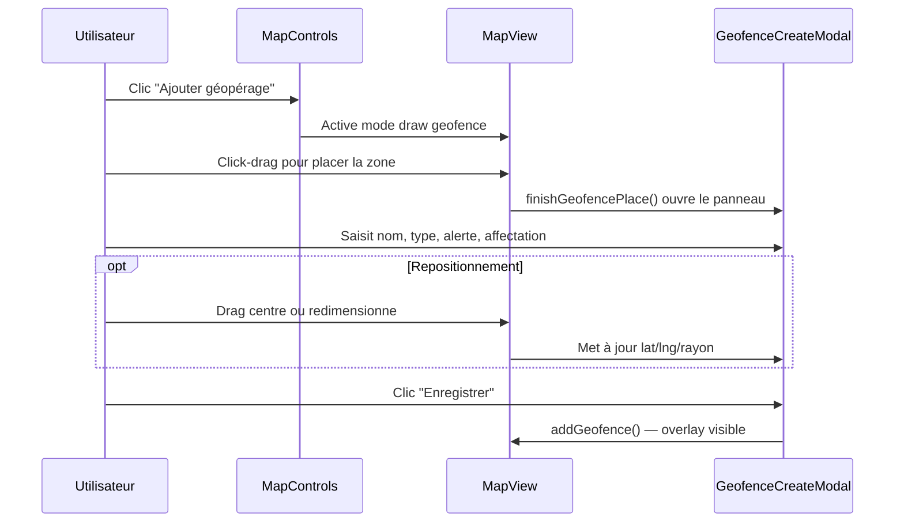
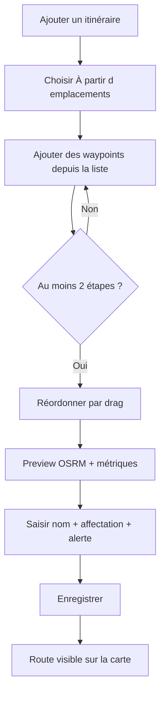
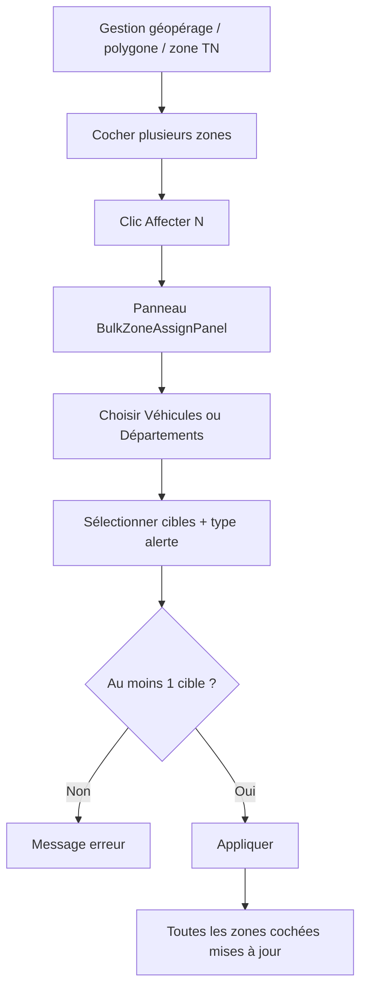

# Epic 8 – Geofencing

**Produit** : FleetIQ  
**Version document** : 1.0  
**Date** : 28 août 2026  
**Objectif** : Décrire l'ensemble des fonctionnalités geofencing pour permettre à l'équipe de comprendre les user stories, les critères d'acceptation et de répartir le travail en tâches.

---

## Table des matières

1. [Vue d'ensemble](#1-vue-densemble)
2. [Architecture et périmètre technique](#2-architecture-et-périmètre-technique)
3. [Glossaire](#3-glossaire)
4. [Features et User Stories](#4-features-et-user-stories)
   - [Feature 1 — Barre d'outils cartographiques](#feature-1--barre-doutils-cartographiques-et-visibilité-des-overlays)
   - [Feature 2 — Gestion des géopérages](#feature-2--gestion-des-géopérages-circulaire--rectangulaire)
   - [Feature 3 — Gestion des polygones](#feature-3--gestion-des-polygones-personnalisés)
   - [Feature 4 — Gestion des emplacements](#feature-4--gestion-des-emplacements-waypoints)
   - [Feature 5 — Gestion des itinéraires](#feature-5--gestion-des-itinéraires)
   - [Feature 6 — Zones par défaut (Tunisie)](#feature-6--zones-par-défaut-gouvernorats-tunisie)
   - [Feature 7 — Affectation véhicules / départements](#feature-7--affectation-véhicules--départements-transverse)
   - [Feature 8 — Configuration des types d'alerte](#feature-8--configuration-des-types-dalerte-geofencing)
   - [Feature 9 — Règles d'alerte par zone](#feature-9--règles-dalerte-par-zone)
   - [Feature 10 — Inspection geofencing par véhicule](#feature-10--inspection-geofencing-par-véhicule)
   - [Feature 11 — Rapport des géofences](#feature-11--rapport-des-géofences)
   - [Feature 12 — Activation module Geofencing (compte)](#feature-12--activation-du-module-geofencing-compte)
5. [Matrice de dépendances](#5-matrice-de-dépendances)
6. [Dette technique et gaps identifiés](#6-dette-technique-et-gaps-identifiés)
7. [Répartition des tâches suggérée](#7-répartition-des-tâches-suggérée)

---

## 1. Vue d'ensemble

L'Epic 8 – Geofencing permet aux gestionnaires de flotte de :

- **Définir des zones géographiques** sur la carte Suivi (géopérages, polygones, itinéraires, emplacements, zones administratives).
- **Affecter ces zones** à des véhicules ou des départements avec un type d'alerte (entrée, sortie, ou les deux).
- **Configurer les alertes geofencing** dans le Centre d'alertes (types d'alerte, règles par zone, inspection par véhicule).
- **Consulter l'activité geofencing** (historique véhicule, rapport — en cours de développement).

### Principe de rédaction

Les fonctionnalités **transverses** (affectation, visibilité des overlays, annulation/refaire) sont décrites **une seule fois** dans leur feature dédiée. Les autres features y font référence sans les répéter.

### Synthèse des features

| # | Feature | Zone applicative |
|---|---------|------------------|
| 1 | Barre d'outils cartographiques | Carte Suivi |
| 2 | Gestion des géopérages | Carte Suivi |
| 3 | Gestion des polygones | Carte Suivi |
| 4 | Gestion des emplacements | Carte Suivi |
| 5 | Gestion des itinéraires | Carte Suivi |
| 6 | Zones par défaut (Tunisie) | Carte Suivi |
| 7 | Affectation véhicules / départements | Transverse (carte) |
| 8 | Configuration types d'alerte | Centre d'alertes |
| 9 | Règles d'alerte par zone | Centre d'alertes |
| 10 | Inspection geofencing véhicule | Centre d'alertes |
| 11 | Rapport des géofences | Rapports |
| 12 | Activation module compte | Administration |

---

## 2. Architecture et périmètre technique

L'Epic repose sur **deux sous-systèmes distincts** qui ne sont pas encore intégrés entre eux :



| Couche | Persistance | Composants clés |
|--------|-------------|-----------------|
| **Carte Suivi** | État React en mémoire (`useMapOverlays`) — **perdu au rechargement** | `MapControls`, `MapView`, `GeofenceCreateModal`, `OverlayAssignModal`, `MapOverlayManagePanel` |
| **Centre d'alertes** | Store mock in-memory (`alert-config-api.ts`) | `GeofencingAlertsSection`, `GeofenceRuleForm`, `VehicleGeofenceSection` |
| **Routage** | Service externe OSRM public | `osrm-routing.ts`, `useRouteMetrics.ts` |

> **Important** : Les overlays créés sur la carte et les règles d'alerte du Centre d'alertes utilisent des identifiants/labels **non liés**. L'intégration backend est un travail à planifier (voir section 6).

---

## 3. Glossaire

| Terme | Définition |
|-------|------------|
| **Géopérage** | Zone géographique de surveillance (synonyme UI de « geofence »). Formes supportées : circulaire, rectangulaire. |
| **Overlay** | Élément géographique affiché sur la carte (géopérage, polygone, route, emplacement, zone par défaut). |
| **Affectation** | Liaison d'une zone à un ou plusieurs véhicules ou départements, avec un type d'alerte associé. |
| **Type d'alerte zone** | `hors_zone` (sortie), `dans_zone` (entrée), `les_deux` (entrée et sortie). |
| **Scope / Périmètre** | Cible de configuration dans le Centre d'alertes : véhicule, groupe de véhicules ou département. |
| **Règle geofence** | Configuration d'alerte liée à une zone nommée, un événement (entrée/sortie) et un périmètre. |
| **OSRM** | Open Source Routing Machine — service de calcul d'itinéraire routier utilisé pour les routes et leurs métriques. |
| **Zone par défaut** | Polygone pré-chargé (24 gouvernorats tunisiens), géométrie en lecture seule, affectation modifiable. |
| **Emplacement** | Point géographique nommé, réutilisable comme waypoint dans un itinéraire. |

---

## 4. Features et User Stories

---

### Feature 1 — Barre d'outils cartographiques et visibilité des overlays

**Description** : Accès centralisé aux opérations géographiques, contrôle de l'affichage carte et actions globales pendant les sessions de dessin.

**Composants** : `MapControls.tsx`, `MapView.tsx`

**Référencée par** : Features 2, 3, 4, 5 (accès création/gestion), Feature 1 seule pour visibilité et undo/redo.

---

#### US-1.1 — Accéder au menu « Opérations géographiques »

**En tant que** gestionnaire de flotte,  
**je veux** accéder à un menu regroupant toutes les opérations géographiques,  
**afin de** créer ou gérer les différents types de zones depuis la carte Suivi.

**Critères d'acceptation :**

- [ ] Un bouton « Opérations géographiques » est visible dans la toolbar flottante de la carte.
- [ ] Le menu propose les actions de **création** :
  - Ajouter géopérage
  - Ajouter un itinéraire
  - Ajouter emplacement
  - Ajouter polygone
- [ ] Le menu propose les actions de **gestion** :
  - Gestion géopérage
  - Gestion des emplacements
  - Gestion des polygones
  - Gestion des routes
  - Gestion des zones par défaut
- [ ] Le menu se ferme au clic extérieur ou après sélection d'une action.

---

#### US-1.2 — Changer le fond de carte

**En tant que** gestionnaire de flotte,  
**je veux** choisir le fond de carte,  
**afin d'** adapter la visualisation à mon contexte (plan, satellite, etc.).

**Critères d'acceptation :**

- [ ] 4 fonds de carte disponibles : **Plan**, **OSM**, **Satellite**, **TUNAV**.
- [ ] Le fond sélectionné est appliqué immédiatement à la carte.
- [ ] Le fond actif est visuellement identifiable dans le menu.

---

#### US-1.3 — Basculer la visibilité d'un overlay

**En tant que** gestionnaire de flotte,  
**je veux** masquer ou afficher un overlay sans le supprimer,  
**afin de** simplifier la lecture de la carte.

**Critères d'acceptation :**

- [ ] Une liste des overlays existants est accessible depuis la toolbar (menu visibilité).
- [ ] Chaque overlay affiche son nom et son type (Géopérage, Emplacement, Route, Polygone, Zone).
- [ ] Un clic sur l'icône œil bascule la visibilité (`visible: true/false`).
- [ ] L'overlay masqué n'est plus rendu sur la carte mais reste dans la liste de gestion.
- [ ] La visibilité peut aussi être togglée depuis les panneaux de gestion (Feature 2, 3, 5, 6).

---

#### US-1.4 — Annuler / refaire pendant un dessin

**En tant que** gestionnaire de flotte,  
**je veux** annuler ou refaire mes actions pendant un dessin,  
**afin de** corriger une erreur sans recommencer entièrement.

**Critères d'acceptation :**

- [ ] **Ctrl+Z** (ou Cmd+Z) annule la dernière action pendant une session de dessin active.
- [ ] **Ctrl+Y** (ou Cmd+Y) refait l'action annulée.
- [ ] **Echap** (ou Esc) annulée l'action.
- [ ] Les raccourcis fonctionnent pour : placement géopérage, ajout de points polygone/route, modification géométrie géopérage.
- [ ] Une bannière contextuelle indique le mode de dessin actif et les actions disponibles.
- [ ] Les raccourcis ne s'activent pas lorsque le focus est dans un champ de formulaire (input, textarea, select).

---

### Feature 2 — Gestion des géopérages (circulaire / rectangulaire)

**Description** : Création, consultation, modification et suppression de zones circulaires ou rectangulaires sur la carte.

**Composants** : `GeofenceCreateModal.tsx`, `MapView.tsx` (`GeofencePlaceHandler`, `GeofenceDraftEditor`), `MapOverlayManagePanel`

**Dépend de** : Feature 1 (accès menu), Feature 7 (affectation — référencée, non redécrite)

---

#### US-2.1 — Créer un géopérage sur la carte

**En tant que** gestionnaire de flotte,  
**je veux** dessiner un géopérage directement sur la carte,  
**afin de** délimiter une zone de surveillance autour d'un point d'intérêt.

**Critères d'acceptation :**

- [ ] L'action « Ajouter géopérage » active le mode dessin sur la carte.
- [ ] L'utilisateur place la zone par **click-drag** (clic maintenu + glisser pour définir le rayon).
- [ ] À la fin du placement, le panneau latéral `GeofenceCreateModal` s'ouvre automatiquement.
- [ ] Un brouillon de géopérage est visible sur la carte pendant la saisie du formulaire.
- [ ] L'utilisateur peut re-cliquer sur la carte pour repositionner tant que le panneau est ouvert.

---

#### US-2.2 — Configurer les métadonnées d'un géopérage

**En tant que** gestionnaire de flotte,  
**je veux** renseigner les informations d'un géopérage,  
**afin de** l'identifier et définir son comportement d'alerte.

**Critères d'acceptation :**

- [ ] Champs disponibles :
  - **Nom** (obligatoire)
  - **Type de géopérage** : Circulaire ou Rectangulaire
  - **Type d'alerte** : Sortie / Entrée / Entrée et sortie
  - **Rayon** (km, obligatoire > 0)
  - **Latitude / Longitude** (modifiables numériquement)
  - **Affectation** (optionnelle — voir Feature 7)
- [ ] Si le nom est vide à l'enregistrement → message « Le nom est requis. »
- [ ] Si le rayon ≤ 0 → message « Rayon invalide. »
- [ ] L'enregistrement crée un overlay persistant sur la carte (`addGeofence`).

---

#### US-2.3 — Repositionner la géométrie pendant la création ou l'édition

**En tant que** gestionnaire de flotte,  
**je veux** ajuster la position et la taille d'un géopérage sur la carte,  
**afin de** affiner la zone sans resaisir les coordonnées manuellement.

**Critères d'acceptation :**

- [ ] Le centre du géopérage est déplaçable par drag sur la carte.
- [ ] Le rayon est modifiable par drag (poignées de redimensionnement).
- [ ] Les modifications sont reflétées en temps réel dans le formulaire (lat, lng, rayon).
- [ ] **Ctrl+Z / Ctrl+Y** permettent d'annuler/refaire les changements de géométrie (Feature 1.4).
- [ ] Un hint textuel rappelle : « Maintenez le clic et glissez pour tracer. Déplacez le point central pour repositionner. »

---

#### US-2.4 — Consulter un géopérage existant

**En tant que** gestionnaire de flotte,  
**je veux** consulter les détails d'un géopérage sans le modifier,  
**afin de** vérifier sa configuration avant toute action.

**Critères d'acceptation :**

- [ ] Depuis « Gestion géopérage », le clic sur l'icône crayon ouvre le panneau en **mode lecture seule**.
- [ ] Le titre affiché est « Détails du géopérage ».
- [ ] Tous les champs sont désactivés (non éditables).
- [ ] Un bouton « Modifier » permet de passer en mode édition.
- [ ] La carte centre/zoom sur la zone du géopérage.

---

#### US-2.5 — Modifier un géopérage existant

**En tant que** gestionnaire de flotte,  
**je veux** modifier un géopérage existant,  
**afin de** adapter sa zone ou sa configuration.

**Critères d'acceptation :**

- [ ] Le passage en mode édition active le formulaire et la géométrie éditable sur la carte.
- [ ] Les modifications de métadonnées et de géométrie sont synchronisées.
- [ ] L'enregistrement met à jour l'overlay existant (`updateGeofence`) sans en créer un nouveau.
- [ ] L'annulation ferme le panneau sans persister les changements.

---

#### US-2.6 — Supprimer un géopérage

**En tant que** gestionnaire de flotte,  
**je veux** supprimer un géopérage,  
**afin de** retirer une zone devenue inutile.

**Critères d'acceptation :**

- [ ] Depuis « Gestion géopérage », l'icône corbeille supprime l'overlay.
- [ ] Le géopérage disparaît immédiatement de la carte et de la liste.
- [ ] Les géopérages de type `gouvernorat` (legacy) ne sont pas supprimables individuellement via ce flux.

---

#### US-2.7 — Lister et localiser les géopérages

**En tant que** gestionnaire de flotte,  
**je veux** voir la liste de tous mes géopérages et m'y rendre sur la carte,  
**afin de** naviguer rapidement dans mon parc de zones.

**Critères d'acceptation :**

- [ ] Le panneau « Gestion géopérage » liste tous les géopérages créés.
- [ ] Chaque item affiche : nom, résumé d'affectation (ex. « 3 véhicules »), type d'alerte.
- [ ] Le bouton « Localiser » (icône cible) centre la carte sur le géopérage.
- [ ] Si la liste est vide → message « Aucun élément enregistré. »

---

#### User Flow — Création d'un géopérage



**Étapes détaillées :**

1. Ouvrir la carte Suivi.
2. Toolbar → « Opérations géographiques » → « Ajouter géopérage ».
3. Sur la carte : clic maintenu + glisser pour définir centre et rayon → relâcher.
4. Le panneau latéral s'ouvre avec le brouillon visible sur la carte.
5. Renseigner le nom (obligatoire), choisir circulaire/rectangulaire, type d'alerte.
6. *(Optionnel)* Affecter véhicules/départements (Feature 7).
7. *(Optionnel)* Ajuster position/taille sur la carte ou via les champs numériques.
8. Cliquer « Enregistrer » → le géopérage apparaît dans la liste de gestion.

---

#### User Flow — Édition d'un géopérage

1. Toolbar → « Opérations géographiques » → « Gestion géopérage ».
2. Repérer le géopérage dans la liste → clic crayon.
3. Panneau en **lecture seule** (« Détails du géopérage ») — vérifier les infos.
4. Clic « Modifier » → formulaire et géométrie activés.
5. Modifier les champs souhaités (nom, alerte, affectation, géométrie).
6. « Enregistrer » → overlay mis à jour sur la carte.

---

#### Note legacy

Les géopérages de type `gouvernorat` (ancien modèle) sont affichés en lecture seule avec un message explicatif. Ils sont remplacés par les **zones par défaut** (Feature 6).

---

### Feature 3 — Gestion des polygones personnalisés

**Description** : Dessin de zones polygonales libres sur la carte avec validation géométrique.

**Composants** : `OverlayAssignModal.tsx`, `polygon-geometry.ts`, `MapOverlayManagePanel`

**Dépend de** : Feature 1, Feature 7

---

#### US-3.1 — Dessiner un polygone sur la carte

**En tant que** gestionnaire de flotte,  
**je veux** dessiner un polygone point par point sur la carte,  
**afin de** définir une zone de forme libre.

**Critères d'acceptation :**

- [ ] L'action « Ajouter polygone » active le mode dessin.
- [ ] Chaque clic sur la carte ajoute un sommet.
- [ ] Un minimum de **3 points** est requis pour terminer.
- [ ] Un compteur de points en attente est visible dans la bannière de dessin.
- [ ] Le bouton « Terminer » valide le dessin et ouvre le panneau d'assignation.

---

#### US-3.2 — Valider la géométrie du polygone

**En tant que** système,  
**je veux** rejeter les polygones auto-intersectants,  
**afin de** garantir une zone géographique valide.

**Critères d'acceptation :**

- [ ] Si le polygone s'auto-intersecte, un message d'erreur est affiché.
- [ ] L'utilisateur ne peut pas terminer le dessin tant que la géométrie est invalide.
- [ ] La validation utilise la logique de `polygon-geometry.ts` (test d'auto-intersection).

---

#### US-3.3 — Enregistrer un polygone avec métadonnées

**En tant que** gestionnaire de flotte,  
**je veux** nommer et configurer un polygone,  
**afin de** l'identifier et définir son comportement d'alerte.

**Critères d'acceptation :**

- [ ] Après validation du dessin, le panneau `OverlayAssignModal` s'ouvre.
- [ ] Champs : nom, affectation (Feature 7), type d'alerte.
- [ ] L'enregistrement crée un overlay polygone visible sur la carte.

---

#### US-3.4 — Modifier / supprimer un polygone

**En tant que** gestionnaire de flotte,  
**je veux** modifier ou supprimer un polygone existant,  
**afin de** maintenir mes zones à jour.

**Critères d'acceptation :**

- [ ] « Gestion des polygones » liste tous les polygones.
- [ ] Édition : mode lecture seule → « Modifier » → édition géométrie + formulaire.
- [ ] Suppression : icône corbeille retire le polygone de la carte et de la liste.
- [ ] Localisation et visibilité disponibles (Feature 1.3, US-2.7 pattern).

---

#### US-3.5 — Annuler le dernier point pendant le dessin

**En tant que** gestionnaire de flotte,  
**je veux** annuler le dernier point ajouté,  
**afin de** corriger une erreur de clic.

**Critères d'acceptation :**

- [ ] Un bouton « Annuler le point » (ou Ctrl+Z) retire le dernier sommet.
- [ ] Le redo (Ctrl+Y) restaure le point annulé.
- [ ] Le preview du polygone se met à jour immédiatement.

---

#### User Flow — Dessin d'un polygone

1. Toolbar → « Ajouter polygone ».
2. Cliquer successivement sur la carte pour placer les sommets (≥ 3).
3. Si auto-intersection → message d'erreur, corriger en annulant des points.
4. Cliquer « Terminer ».
5. Panneau assignation : saisir nom, affectation (Feature 7), type d'alerte.
6. « Enregistrer » → polygone visible sur la carte.

---

### Feature 4 — Gestion des emplacements (waypoints)

**Description** : Points géographiques nommés, utilisables comme étapes d'itinéraires.

**Composants** : `LocationCreateModal.tsx`, `MapOverlayManagePanel`

**Dépend de** : Feature 1

---

#### US-4.1 — Créer un emplacement

**En tant que** gestionnaire de flotte,  
**je veux** placer un emplacement nommé sur la carte,  
**afin de** réutiliser des points de repère dans mes itinéraires.

**Critères d'acceptation :**

- [ ] « Ajouter emplacement » active le mode clic sur carte.
- [ ] Un clic ouvre le panneau `LocationCreateModal` avec les coordonnées pré-remplies.
- [ ] L'utilisateur saisit un nom et enregistre.
- [ ] L'emplacement apparaît comme marqueur sur la carte.

---

#### US-4.2 — Modifier / supprimer un emplacement

**En tant que** gestionnaire de flotte,  
**je veux** modifier ou supprimer un emplacement,  
**afin de** corriger ou retirer un point de repère.

**Critères d'acceptation :**

- [ ] « Gestion des emplacements » liste tous les emplacements.
- [ ] Édition : modifier le nom et/ou repositionner sur la carte.
- [ ] Suppression : retire l'emplacement de la carte et de la liste.

---

#### US-4.3 — Réutiliser un emplacement dans un itinéraire

**En tant que** gestionnaire de flotte,  
**je veux** sélectionner des emplacements existants lors de la création d'un itinéraire,  
**afin de** construire un parcours à partir de points connus.

**Critères d'acceptation :**

- [ ] Les emplacements créés (US-4.1) apparaissent dans le sélecteur de `RouteViaLocationsForm` (Feature 5).
- [ ] L'utilisateur peut rechercher un emplacement par nom.
- [ ] Un emplacement peut être ajouté plusieurs fois comme étape dans un même itinéraire.

> **Note** : La création d'emplacement depuis le flux itinéraire (« Ajouter un emplacement ») est couverte par US-4.1 ; le flux itinéraire y renvoie sans dupliquer la logique.

---

### Feature 5 — Gestion des itinéraires

**Description** : Création d'itinéraires routiers via emplacements ou points carte, avec calcul OSRM.

**Composants** : `RouteCreatePanel.tsx`, `RouteViaLocationsForm.tsx`, `RouteMetricsSummary.tsx`, `osrm-routing.ts`, `useRouteMetrics.ts`

**Dépend de** : Feature 1, Feature 4 (mode emplacements), Feature 7

---

#### US-5.1 — Choisir le mode de création d'itinéraire

**En tant que** gestionnaire de flotte,  
**je veux** choisir comment construire mon itinéraire,  
**afin d'** utiliser la méthode la plus adaptée à mon cas.

**Critères d'acceptation :**

- [ ] « Ajouter un itinéraire » ouvre `RouteCreatePanel` avec 2 options :
  - **À partir d'emplacements** — sélection de waypoints existants
  - **Points sur la carte** — clics successifs sur la carte
- [ ] Chaque option affiche un titre et une description explicative.
- [ ] Un bouton retour permet de revenir au choix de mode.

---

#### US-5.2 — Créer un itinéraire via emplacements

**En tant que** gestionnaire de flotte,  
**je veux** construire un itinéraire en sélectionnant des emplacements ordonnés,  
**afin de** définir un parcours basé sur des points de repère connus.

**Critères d'acceptation :**

- [ ] L'utilisateur ajoute des emplacements comme étapes (minimum **2**).
- [ ] Les étapes sont **réordonnables par drag-and-drop**.
- [ ] Des boutons flèche haut/bas permettent aussi de réordonner.
- [ ] Un aperçu OSRM calcule la géométrie routière en temps réel.
- [ ] Distance et durée estimées sont affichées (`RouteMetricsSummary`).
- [ ] L'utilisateur saisit un nom, une affectation (Feature 7) et un type d'alerte avant enregistrement.

---

#### US-5.3 — Créer un itinéraire via points sur la carte

**En tant que** gestionnaire de flotte,  
**je veux** tracer un itinéraire en cliquant des points sur la carte,  
**afin de** définir un parcours libre.

**Critères d'acceptation :**

- [ ] Chaque clic ajoute un waypoint (minimum **2** points).
- [ ] L'aperçu OSRM se met à jour (debounced) à chaque ajout de point.
- [ ] Distance et durée affichées en temps réel.
- [ ] Undo point disponible (Feature 1.4).
- [ ] « Terminer » ouvre le panneau d'assignation (nom, affectation, alerte).

---

#### US-5.4 — Enregistrer un itinéraire

**En tant que** gestionnaire de flotte,  
**je veux** enregistrer un itinéraire avec ses métadonnées,  
**afin de** le surveiller et recevoir des alertes de déviation.

**Critères d'acceptation :**

- [ ] L'itinéraire enregistré contient : nom, points (géométrie OSRM), waypoints originaux, distance (m), durée (s), affectation, type d'alerte.
- [ ] La route est rendue sur la carte comme polyligne.
- [ ] Les waypoints originaux restent identifiables (épingles).

---

#### US-5.5 — Modifier / supprimer un itinéraire

**En tant que** gestionnaire de flotte,  
**je veux** modifier ou supprimer un itinéraire existant,  
**afin de** adapter les parcours surveillés.

**Critères d'acceptation :**

- [ ] « Gestion des routes » liste les itinéraires avec distance et durée formatées.
- [ ] Édition : mode lecture seule → « Modifier » → formulaire + édition géométrie.
- [ ] Suppression : retire la route de la carte et de la liste.
- [ ] Un bouton « Ajouter un itinéraire » est accessible depuis le panneau de gestion.

---

#### US-5.6 — Fallback routier si OSRM indisponible

**En tant que** système,  
**je veux** afficher un tracé même si le service OSRM est indisponible,  
**afin de** ne pas bloquer l'utilisateur.

**Critères d'acceptation :**

- [ ] Si l'appel OSRM échoue, une polyligne en ligne droite entre les waypoints est affichée.
- [ ] Les métriques affichent « — » ou une estimation en ligne droite.
- [ ] L'utilisateur peut quand même enregistrer l'itinéraire.

---

#### User Flow — Itinéraire via emplacements



**Étapes détaillées :**

1. Toolbar → « Ajouter un itinéraire ».
2. Choisir « À partir d'emplacements ».
3. Rechercher et ajouter des emplacements (min. 2).
4. Réordonner les étapes si nécessaire (drag ou flèches).
5. Vérifier distance/durée dans le résumé OSRM.
6. Saisir le nom, l'affectation (Feature 7), le type d'alerte.
7. Enregistrer.

---

#### User Flow — Itinéraire via points carte

1. Toolbar → « Ajouter un itinéraire » → « Points sur la carte ».
2. Cliquer ≥ 2 points sur la carte.
3. Observer le preview OSRM et les métriques.
4. *(Optionnel)* Annuler le dernier point (Ctrl+Z).
5. Cliquer « Terminer ».
6. Panneau assignation : nom, affectation, alerte → Enregistrer.

---

### Feature 6 — Zones par défaut (gouvernorats Tunisie)

**Description** : 24 zones administratives pré-chargées (gouvernorats tunisiens), géométrie non modifiable.

**Composants** : `tunisia-provinces.ts`, `OverlayAssignModal.tsx`, `MapOverlayManagePanel`

**Dépend de** : Feature 1, Feature 7

---

#### US-6.1 — Afficher les zones gouvernorats

**En tant que** gestionnaire de flotte tunisien,  
**je veux** voir les gouvernorats pré-définis sur la carte,  
**afin de** surveiller des zones administratives sans les dessiner.

**Critères d'acceptation :**

- [ ] 24 zones (gouvernorats) sont chargées automatiquement au démarrage de l'application.
- [ ] Chaque zone affiche le nom du gouvernorat.
- [ ] La géométrie est en **lecture seule** (`readonly: true`).
- [ ] Les zones sont masquables via la visibilité (Feature 1.3).

---

#### US-6.2 — Affecter des véhicules/départements à une zone par défaut

**En tant que** gestionnaire de flotte,  
**je veux** affecter des véhicules à un gouvernorat,  
**afin de** recevoir des alertes entrée/sortie sur ce périmètre administratif.

**Critères d'acceptation :**

- [ ] Seuls l'**affectation** et le **type d'alerte** sont modifiables.
- [ ] Le nom et la géométrie ne sont pas éditables.
- [ ] Le panneau d'édition utilise `OverlayAssignModal` en mode zone par défaut.

---

#### US-6.3 — Gérer la liste des zones par défaut

**En tant que** gestionnaire de flotte,  
**je veux** consulter et gérer les affectations des zones par défaut,  
**afin de** avoir une vue d'ensemble des gouvernorats surveillés.

**Critères d'acceptation :**

- [ ] « Gestion des zones par défaut » liste les 24 gouvernorats.
- [ ] Sous-titre : « Provinces — Tunisie ».
- [ ] Pas de bouton supprimer ni d'édition de géométrie.
- [ ] Localisation, visibilité et édition d'affectation disponibles.
- [ ] Sélection multiple + affectation groupée possible (Feature 7.5).

---

### Feature 7 — Affectation véhicules / départements (transverse)

**Description** : Composant partagé d'affectation de zones à des véhicules ou départements, avec choix du type d'alerte. Utilisé par les Features 2, 3, 5, 6 et l'affectation groupée.

**Composants** : `GeoAssignmentFields.tsx`, `BulkZoneAssignPanel.tsx`

> **Cette feature est la référence unique pour l'affectation.** Les autres features renvoient ici sans redécrire les critères.

---

#### US-7.1 — Choisir le mode d'affectation

**En tant que** gestionnaire de flotte,  
**je veux** choisir d'affecter une zone à des véhicules ou à des départements,  
**afin de** cibler le bon périmètre organisationnel.

**Critères d'acceptation :**

- [ ] Un toggle **Véhicules / Départements** est affiché.
- [ ] Le changement de mode réinitialise la sélection courante.
- [ ] En mode Véhicules : liste des véhicules (nom + conducteur).
- [ ] En mode Départements : liste des départements de l'organisation.

---

#### US-7.2 — Sélectionner plusieurs cibles

**En tant que** gestionnaire de flotte,  
**je veux** sélectionner plusieurs véhicules ou départements,  
**afin d'** appliquer la même zone à plusieurs cibles.

**Critères d'acceptation :**

- [ ] Multi-sélection par checkbox.
- [ ] Badges affichant les éléments sélectionnés (clic sur × pour retirer).
- [ ] Compteur « N sélectionné(s) » visible.
- [ ] Champ de **recherche** filtre la liste par nom ou identifiant.
- [ ] Boutons « Tout sélectionner » / « Tout désélectionner » (sur la liste filtrée).

---

#### US-7.3 — Choisir le type d'alerte zone

**En tant que** gestionnaire de flotte,  
**je veux** définir si l'alerte se déclenche à l'entrée, à la sortie, ou les deux,  
**afin de** contrôler le comportement de surveillance.

**Critères d'acceptation :**

- [ ] 3 options : **Sortie** (`hors_zone`), **Entrée** (`dans_zone`), **Entrée et sortie** (`les_deux`).
- [ ] La sélection est persistée avec l'affectation de la zone.
- [ ] Valeur par défaut en affectation groupée : « Entrée et sortie ».

---

#### US-7.4 — Enregistrer une zone sans affectation

**En tant que** gestionnaire de flotte,  
**je veux** enregistrer une zone sans affectation immédiate,  
**afin de** la configurer plus tard.

**Critères d'acceptation :**

- [ ] L'affectation est **optionnelle** à la création.
- [ ] Un message explicite indique : « Vous pouvez enregistrer sans affectation et assigner plus tard via Gérer. »
- [ ] L'affectation peut être ajoutée ultérieurement via le panneau de gestion ou d'édition.

---

#### US-7.5 — Affectation groupée (bulk)

**En tant que** gestionnaire de flotte,  
**je veux** affecter plusieurs zones en une seule opération,  
**afin de** gagner du temps sur des configurations répétitives.

**Critères d'acceptation :**

- [ ] Disponible pour : géopérages, polygones, zones par défaut (pas les routes ni emplacements).
- [ ] Cases à cocher sur chaque item + « Tout sélectionner » dans le panneau de gestion.
- [ ] Bouton sticky « Affecter (N) » apparaît dès qu'au moins 1 zone est cochée.
- [ ] Le panneau `BulkZoneAssignPanel` s'ouvre avec le composant d'affectation (US-7.1 à 7.3).
- [ ] Au moins **1 véhicule ou département** doit être sélectionné, sinon message d'erreur.
- [ ] L'application met à jour l'affectation et le type d'alerte de **toutes** les zones cochées.

---

#### User Flow — Affectation groupée



---

### Feature 8 — Configuration des types d'alerte geofencing

**Description** : Activation/désactivation des types d'alerte de géolocalisation par périmètre dans le Centre d'alertes.

**Composants** : `GeofencingAlertsSection.tsx`, `GeolocationAlertsConfigSection.tsx`, `alert-taxonomy.ts`, `geolocation-alert-groups.ts`

---

#### US-8.1 — Accéder à la section « Alerte Geofencing »

**En tant que** administrateur alertes,  
**je veux** accéder à la configuration geofencing,  
**afin de** paramétrer les alertes de géolocalisation.

**Critères d'acceptation :**

- [ ] La page « Configuration alertes » contient une section « Alerte Geofencing ».
- [ ] Description affichée : « Zones, itinéraires et règles geofence configurables ».
- [ ] La section contient deux sous-parties : types d'alerte et règles par zone.

---

#### US-8.2 — Sélectionner un périmètre de configuration

**En tant que** administrateur alertes,  
**je veux** sélectionner un véhicule, groupe ou département,  
**afin de** configurer les alertes pour un périmètre précis.

**Critères d'acceptation :**

- [ ] Sans périmètre sélectionné → message « Sélectionnez un périmètre pour activer les types d'alerte geofencing. »
- [ ] Les toggles sont désactivés tant qu'aucun scope n'est sélectionné.
- [ ] Types de scope supportés : véhicule, groupe de véhicules, département.

---

#### US-8.3 — Activer / désactiver un type d'alerte geolocation

**En tant que** administrateur alertes,  
**je veux** activer ou désactiver chaque type d'alerte de géolocalisation,  
**afin de** contrôler quelles alertes remontent dans le Centre d'alertes.

**Critères d'acceptation :**

- [ ] Les types sont groupés en 3 catégories :

**Zones :**
| Type | Label |
|------|-------|
| `geofence` | Entrée Geofence |
| `geofence_exit` | Sortie Geofence |
| `polygon_exit` | Sortie polygone autorisé |
| `city_exit` | Sortie de ville autorisée |
| `restricted_hours` | Circulation horaires interdits |
| `country_border` | Frontière / proximité |

**Itinéraire :**
| Type | Label |
|------|-------|
| `route` | Déviation de trajectoire |
| `departure_point` | Arrivée point de départ |
| `arrival_point` | Arrivée destination |
| `taxi_status` | Début / fin mission |

**Arrêts :**
| Type | Label |
|------|-------|
| `long_stop` | Arrêt prolongé |
| `abnormal_immobilization` | Immobilisation anormale |
| `stop` | Ralenti excessif |

- [ ] Chaque type a un toggle on/off.
- [ ] Le changement est persisté via l'API de configuration (`batchUpsertScopeConfigs`).
- [ ] Les véhicules alertés apparaissent dans le dashboard du Centre d'alertes.

---

#### US-8.4 — Voir l'état résolu de configuration

**En tant que** administrateur alertes,  
**je veux** voir si un type d'alerte est actif, inactif ou partiellement configuré,  
**afin de** identifier les configurations incomplètes.

**Critères d'acceptation :**

- [ ] État **actif** : bordure verte, toggle ON.
- [ ] État **inactif** : bordure grise, toggle OFF.
- [ ] État **partiel** : bordure ambre + badge « Partiel » (configuration héritée mixte sur le périmètre).

---

### Feature 9 — Règles d'alerte par zone

**Description** : CRUD de règles d'alerte geofence liées à une zone nommée, un événement et un périmètre.

**Composants** : `GeofenceRuleForm.tsx`, `GeofencingAlertsSection.tsx`, `mockGeofenceRules.ts`

---

#### US-9.1 — Créer une règle geofence

**En tant que** administrateur alertes,  
**je veux** créer une règle d'alerte associée à une zone,  
**afin de** déclencher des alertes sur des événements d'entrée/sortie.

**Critères d'acceptation :**

- [ ] Bouton « Ajouter une règle » ouvre un dialog avec le formulaire.
- [ ] Champs :
  - **Nom de la règle** (texte libre ; défaut = nom de zone si vide)
  - **Zone** (liste déroulante — actuellement liste mock)
  - **Type d'événement** : Entrée zone / Sortie zone / Entrée et sortie
  - **Périmètre** : Véhicule ou Département
  - **Cibles** : multi-sélection véhicules ou départements (obligatoire, ≥ 1)
  - **Règle active** : toggle (défaut ON)
  - **Activation** : Permanente ou Temporaire (avec dates début/fin)
- [ ] Si aucune cible sélectionnée → « Sélectionnez au moins une cible. »
- [ ] Enregistrement via `saveGeofenceRule` → règle visible dans la liste.

---

#### US-9.2 — Modifier une règle existante

**En tant que** administrateur alertes,  
**je veux** modifier une règle existante,  
**afin de** ajuster sa configuration.

**Critères d'acceptation :**

- [ ] Clic crayon ouvre le dialog pré-rempli avec les valeurs actuelles.
- [ ] Tous les champs sont modifiables.
- [ ] « Enregistrer » met à jour la règle existante (même ID).

---

#### US-9.3 — Supprimer une règle

**En tant que** administrateur alertes,  
**je veux** supprimer une règle devenue inutile,  
**afin de** nettoyer la configuration.

**Critères d'acceptation :**

- [ ] Clic corbeille supprime la règle via `deleteGeofenceRule`.
- [ ] La règle disparaît immédiatement de la liste.

---

#### US-9.4 — Activer / désactiver une règle

**En tant que** administrateur alertes,  
**je veux** activer ou désactiver une règle sans la supprimer,  
**afin de** la suspendre temporairement.

**Critères d'acceptation :**

- [ ] Toggle inline sur chaque règle dans la liste.
- [ ] Badge « Actif » (vert) ou « Inactif » (outline) reflète l'état.
- [ ] Le changement est persisté immédiatement sans ouvrir le formulaire.

---

#### US-9.5 — Filtrer les règles par périmètre sélectionné

**En tant que** administrateur alertes,  
**je veux** voir uniquement les règles pertinentes pour mon périmètre,  
**afin de** me concentrer sur la configuration en cours.

**Critères d'acceptation :**

- [ ] Si un périmètre est sélectionné, seules les règles qui s'y appliquent sont affichées.
- [ ] Une règle département s'applique aux véhicules de ce département.
- [ ] Une règle véhicule s'applique au département parent si celui-ci est sélectionné.
- [ ] Sans filtre → toutes les règles sont listées.
- [ ] Liste vide → message contextualisé.

---

#### User Flow — Création d'une règle geofence

1. Aller dans **Configuration alertes** → section **Alerte Geofencing**.
2. *(Optionnel)* Sélectionner un périmètre (véhicule/département).
3. Section « Règles par zone » → « Ajouter une règle ».
4. Renseigner le nom, choisir la zone dans la liste.
5. Choisir le type d'événement (entrée/sortie/les deux).
6. Sélectionner le périmètre (véhicule ou département) et les cibles.
7. Configurer l'activation (permanente ou plage temporelle).
8. « Ajouter la règle » → règle visible dans la liste avec badges.

---

### Feature 10 — Inspection geofencing par véhicule

**Description** : Consultation des règles actives et de l'historique geofencing pour un véhicule donné.

**Composants** : `VehicleGeofenceSection.tsx`, `VehicleInspectorPanel.tsx`

---

#### US-10.1 — Voir les règles actives d'un véhicule

**En tant que** opérateur du Centre d'alertes,  
**je veux** voir les règles geofencing actives pour un véhicule,  
**afin de** comprendre quelles zones le concernent.

**Critères d'acceptation :**

- [ ] Dans l'inspecteur véhicule, section « Règles actives ».
- [ ] Chaque règle affiche : nom, label de zone, badge type événement (Entrée/Sortie/Entrée-Sortie).
- [ ] Seules les règles actives (`enabled: true`) applicables au véhicule (directement ou via département) sont listées.
- [ ] Si aucune règle → « Aucune alerte geofencing activée ».
- [ ] État de chargement : skeletons affichés.

---

#### US-10.2 — Voir l'historique geofencing d'un véhicule

**En tant que** opérateur du Centre d'alertes,  
**je veux** consulter l'historique des événements geofencing d'un véhicule,  
**afin de** analyser ses entrées et sorties de zone.

**Critères d'acceptation :**

- [ ] Section « Historique geofencing » avec timeline d'événements.
- [ ] Événements filtrés aux types geofence (`geofence`, `geofence_exit`, etc.).
- [ ] Affichage initial limité à **3 événements**, extensible (« Voir plus »).
- [ ] État de chargement : skeletons affichés.

---

### Feature 11 — Rapport des géofences

**Description** : Rapport consolidé des entrées/sorties de zones. **État actuel : placeholder UI.**

**Composants** : `ReportsContent.tsx` (`RapportGeofencesContent`), `Sidebar.tsx`

---

#### US-11.1 — Accéder au rapport géofences

**En tant que** gestionnaire de flotte,  
**je veux** accéder au rapport des géofences depuis le menu,  
**afin de** consulter l'activité des zones.

**Critères d'acceptation :**

- [ ] Entrée « Rapport des Géofences » visible dans la sidebar Rapports.
- [ ] La page affiche le titre « Rapport des Géofences » et la description « Suivi des entrées/sorties de zones ».

---

#### US-11.2 — Consulter l'activité entrées/sorties

**En tant que** gestionnaire de flotte,  
**je veux** voir un tableau des entrées et sorties de zones,  
**afin d'** analyser l'activité geofencing de ma flotte.

**Critères d'acceptation :**

- [ ] **État actuel (placeholder)** : bloc « Activité géofences » avec texte « Entrées et sorties des zones définies... » sans données réelles.
- [ ] **Cible future** :
  - [ ] Filtres : période, véhicule, zone, type événement.
  - [ ] Tableau : date/heure, véhicule, zone, type (entrée/sortie), durée dans la zone.
  - [ ] Export CSV/PDF.
  - [ ] Données alimentées par le backend (événements geofencing persistés).

---

### Feature 12 — Activation du module Geofencing (compte)

**Description** : Toggle au niveau compte pour activer/désactiver la fonctionnalité geofencing.

**Composants** : `AddAccountModal.tsx`

---

#### US-12.1 — Activer la fonctionnalité Geofencing pour un compte

**En tant que** super-administrateur,  
**je veux** activer ou désactiver le module Geofencing pour un compte client,  
**afin de** contrôler l'accès à cette fonctionnalité.

**Critères d'acceptation :**

- [ ] Dans le formulaire de création/édition de compte, un toggle « Geofencing » est disponible dans la liste des fonctionnalités.
- [ ] L'état est persisté avec le compte.
- [ ] *(À implémenter côté accès)* : si désactivé, les menus geofencing ne sont pas accessibles pour ce compte.

---

## 5. Matrice de dépendances

| Feature | Dépend de |
|---------|-----------|
| Feature 1 | — (autonome) |
| Feature 2 | Feature 1, Feature 7 |
| Feature 3 | Feature 1, Feature 7 |
| Feature 4 | Feature 1 |
| Feature 5 | Feature 1, Feature 4, Feature 7 |
| Feature 6 | Feature 1, Feature 7 |
| Feature 7 | — (autonome, consommée par 2, 3, 5, 6) |
| Feature 8 | — (autonome, Centre d'alertes) |
| Feature 9 | Feature 8 (même page config) |
| Feature 10 | Feature 9 (règles affichées) |
| Feature 11 | Backend événements (future) |
| Feature 12 | — (autonome, admin) |

### Composants partagés

| Composant | Utilisé par |
|-----------|-------------|
| `GeoAssignmentFields` | Feature 2, 3, 5, 6, 7 |
| `BulkZoneAssignPanel` | Feature 7 |
| `MapSidePanel` | Tous les panneaux latéraux carte |
| `MapOverlayManagePanel` | Features 2, 3, 4, 5, 6 |
| `OverlayAssignModal` | Features 3, 5, 6 |

---

## 6. Dette technique et gaps identifiés

| # | Gap | Impact | Priorité suggérée |
|---|-----|--------|-------------------|
| G1 | **Pas de persistance backend** pour les overlays carte | Données perdues au refresh | Haute |
| G2 | **Règles alerte non liées** aux overlays carte (labels mock vs IDs réels) | Incohérence produit | Haute |
| G3 | **Rapport géofences placeholder** | Pas de reporting | Moyenne |
| G4 | **OSRM public** (`router.project-osrm.org`) | Limites rate/ prod / offline | Moyenne |
| G5 | **Toggle compte geofencing** non branché sur l'accès UI | Feature flag inopérant | Basse |
| G6 | **Détection entrée/sortie** non implémentée côté backend | Alertes non générées en production | Haute |
| G7 | **Type gouvernorat legacy** sur géopérages | Dette migration vers zones par défaut | Basse |

---

## 7. Répartition des tâches suggérée

### Équipe Frontend

| Tâche | Features | Détail |
|-------|----------|--------|
| Finaliser UI carte | 1–6 | Déjà implémentée — tests E2E, polish UX, accessibilité |
| Brancher persistance API | 2–6 | Remplacer `useState` par appels API CRUD overlays |
| Lier règles ↔ overlays | 9 | Sélecteur de zone depuis overlays réels (plus mock) |
| Implémenter rapport | 11 | Tableau, filtres, export, connexion API |
| Feature flag compte | 12 | Masquer menus si geofencing désactivé |
| Tests unitaires | 7 | `GeoAssignmentFields`, validation polygone, OSRM fallback |

### Équipe Backend

| Tâche | Features | Détail |
|-------|----------|--------|
| API CRUD overlays | 2–6 | Modèle : geofence, polygon, route, location, defaultZone |
| API affectations | 7 | Lier zones ↔ véhicules/départements + type alerte |
| Moteur détection | 2–6, 8 | Calcul entrée/sortie/déviation en temps réel |
| API règles geofence | 9 | CRUD `GeofenceAlertRule` persisté |
| API événements | 10, 11 | Historique + feed rapport |
| API config alertes | 8 | `AlertScopeConfig` geolocation persisté |

### Équipe Intégration / DevOps

| Tâche | Détail |
|-------|--------|
| OSRM self-hosted ou alternative | Remplacer endpoint public pour prod |
| Lien overlays ↔ règles ↔ alertes | Modèle unifié « Zone » référençable partout |
| MSW → API réelle | Migrer mocks `alert-config-api.ts` et `mockGeofenceRules.ts` |

---

## Annexe — Types de données clés

### GeofenceOverlay (carte)

```
id, kind: 'geofence', name, assignment, shapeType, alertType,
radiusKm, center [lat, lng], visible
```

### GeofenceAlertRule (Centre d'alertes)

```
id, name, zoneLabel, eventType, severity, enabled,
scopeType, scopeIds[], activationType, activationStart?, activationEnd?
```

### Types d'alerte zone (carte)

| Valeur | Label UI |
|--------|----------|
| `hors_zone` | Sortie |
| `dans_zone` | Entrée |
| `les_deux` | Entrée et sortie |

---

*Document généré à partir de l'analyse du code frontend FleetIQ — Epic 8 Geofencing.*
